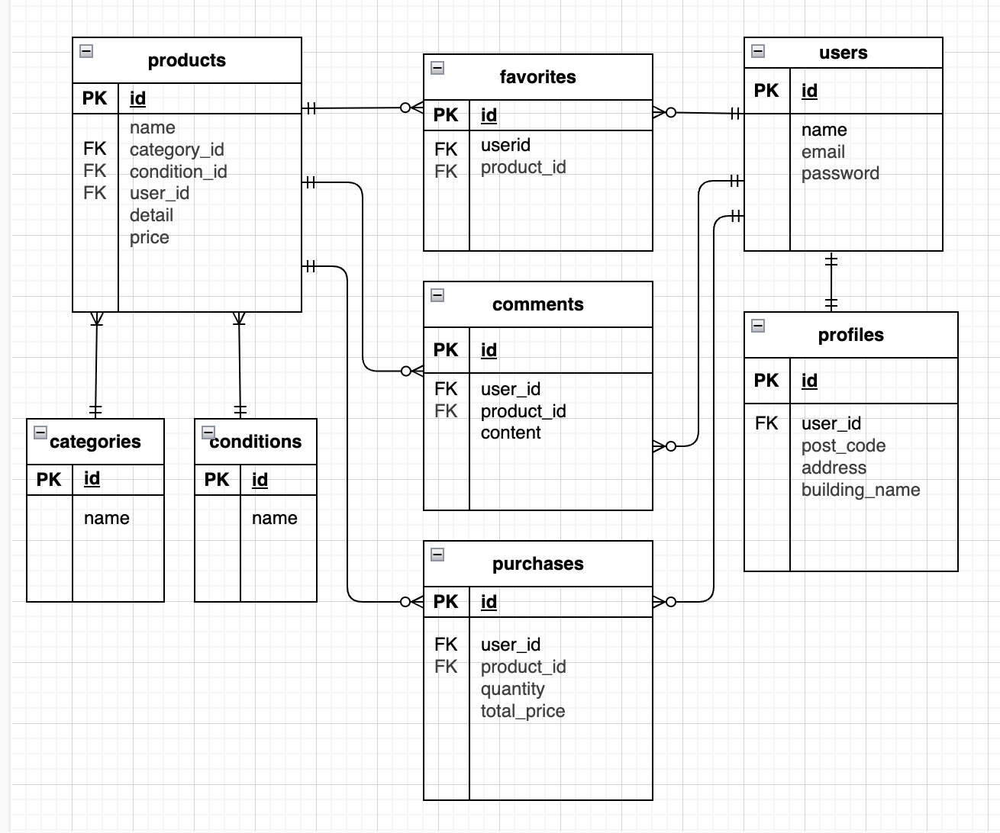

# Flea-market(フリーマーケットアプリ)
- 商品の購入・出品ができるフリマアプリ。
- 口コミ・評価の投稿可能。
- 会員登録者のみ売買可能。

## 「ものは、使える限り大切に」
省資源・省エネルギーの思想と、環境保全まで含めた考え方で、不用品や再生が可能なものを持ち寄り売買することにより、ゴミの削減に貢献できます。

廃盤になり手に入らなくなったモノや、買ってみたものの使用せず勿体無いモノを、使ってくれる方の元へ。そんな考えの元、こちらのアプリを作成しました。

## http://localhost/

### 注意事項
ログインするには会員登録が必須です。
(メール認証機能あり。)

## リポジトリ構成
本プロジェクトはLaravelを使用しており、バックエンドとフロントエンドの両方を1つのリポジトリで管理しています。Bladeテンプレートエンジンを使用してフロントエンドのビューを構築しています。

## 機能一覧
- 会員登録
- ログイン/ログアウト
- メール認証
- ユーザー情報取得
- 商品一覧取得
- 商品詳細取得
- いいね一覧取得(マイリスト)
- いいね追加/削除
- 商品購入
- 購入情報取得
- 商品出品
- 出品情報取得
- コメント記載
- 商品名で検索する
- プロフィール登録/変更
- Stripeを利用しての決済機能
- 画像のストレージ保存

## 使用技術(実行環境)
**言語**
    PHP
    JavaScript

**フレームワーク**
Laravel Framework 8.83.29

**実行環境**
### インフラストラクチャ
- Docker Compose: version 2.33.1
- Nginx: 1.21.1
- MySQL: 8.0.26
- PHP: 7.4.9
- PHPMyAdmin: 5.2.2

### ポート設定
- Web: 80番ポート
- PHP: 8000番ポート
- PHPMyAdmin: 8080番ポート

### データベース
- データベース名: laravel_db
- ユーザー名: laravel_user

## テーブル設計

## ER図

# 環境構築

このアプリケーションをローカルで動作させるには、以下の手順に従ってください。

## 前提条件

このプロジェクトを始めるには、以下のツールがインストールされている必要があります：

- [Docker](https://www.docker.com/)（バージョン 20.x 以上推奨）
- [Docker Compose](https://docs.docker.com/compose/)（バージョン 1.29.2 以上推奨）
- git（プロジェクトをクローンするため）

---

## 環境構築手順

### 1.リポジトリをクローン
   以下のコマンドでプロジェクトをクローンします。

git clone https://github.com/yokoyonezawa/flea-market

### 2.env ファイルを作成

APP_NAME=Laravel
APP_ENV=local
APP_KEY=base64:vVwLLgc2kLRxIL2aWpvOBcw5Z5mLguoGDqy/w6wzycQ=
APP_DEBUG=true
APP_URL=http://localhost

DB_CONNECTION=mysql
DB_HOST=mysql
DB_PORT=3306
DB_DATABASE=laravel_db
DB_USERNAME=laravel_user
DB_PASSWORD=laravel_pass

MAIL_MAILER=smtp
MAIL_HOST=mailhog
MAIL_PORT=1025
MAIL_USERNAME=null
MAIL_PASSWORD=null
MAIL_ENCRYPTION=null
MAIL_FROM_ADDRESS=test@test
MAIL_FROM_NAME="${APP_NAME}"

STRIPE_KEY=pk_test_51QShsSRwPvlvtVmRSNz23C0NtHmOZAXd0ZDwBmV2kLoQZhhHRMw53wmCEGPbEqDgWfju5ouCLtlErVOUAagxl57R00H9UPXBC1
STRIPE_SECRET=sk_test_51QShsSRwPvlvtVmRvU5AoPdf7vAA5PgeJXpkMGAMTxJeqkjdaNynsT7PanyLq79FRAYqij63hG2o86Lm3O1T0XNE00DMVDut1u

### 3. Dockerコンテナをビルドして起動
次のコマンドを実行して、コンテナを構築して起動します。

-bash-

docker-compose up -d --build

### 4. データベースのマイグレーションと初期データ設定
以下のコマンドを使って、データベースをセットアップします。

-bash-

docker compose exec php bash

php artisan migrate --seed

### 5. ブラウザでアクセス
サービスが正しく起動していれば、次のURLでアプリケーションにアクセスできます。

http://localhost:8000

### Docker構成ファイルの説明
このプロジェクトでは、以下のサービスをDockerで構築しています：

- nginx: フロントエンドウェブサーバー。(1.21.1)
- php: アプリケーションの実行環境（PHP 7.4.9）。
- mysql: データベース（MySQL 8.0.26）。
- phpmyadmin: データベース管理ツール。(8.0.26)

### トラブルシューティング

- エラーが発生する場合

ログを確認して問題を特定します

-bash-

docker-compose logs

- Laravelキャッシュのクリア

Laravelのキャッシュが原因で問題が発生している場合、以下を実行します。

-bash-

php artisan config:clear

php artisan cache:clear

php artisan route:clear
